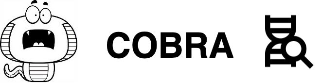

########################
COBRA documentation
########################

********
Overview
********
COBRA is more than a snake. It is a spy who would guide you to find TF target genes given enough information.

COBRA relies mostly on its sense of ChIP-seq smell and its sense of RNA-seq touch to play the game of TF targets hunting.

.. COBRA apples a probabilistic model, which integrates cistromes obtained from TF binding ChIP-seq data and differential gene expression, to compute the target probability based on the experiments. The whole process could be divided by four main steps: high confidence peak clustering, binding site scoring, differential expression analysis, and integration.

.. rst-class:: clearfix row

.. rst-class:: column column2

:ref:`installation` - start here
=============================

For the new cobra users, how to setup a COBRA-friendly environment.

.. rst-class:: column column2

:ref:`how-to`
=============

Practical step-by-step guides for the new users, covering several important topics.

.. rst-class:: column column2

:ref:`key-points`
=================

Explanation and analysis of some key features.

.. rst-class:: column column2

:ref:`reference`
================

Technical reference material, for classes, methods, APIs, commands.

************************
Why the name COBRA?
************************
.. caution:: Welcome to ss-zoo!
 We currently have ``SpideR``, ``COBRA``. Our new members - ``Priranha``, ``FROGS`` will be coming soon as well.

Actually, you can find lots of ways to make sense of cobra. Here are the ways we think:

- Literally: Combined Binding and Regulatory Analysis.
- Programming language: This snake was written in python.
- In Chinese: Glasses snake. Hopefully, with the glasses, cobra could find the target gene easier.

********
About us
********

In ss-zoo, we currently have SpideR, COBRA. Our new members - Priranha, FROGS - will becoming soon as well.
